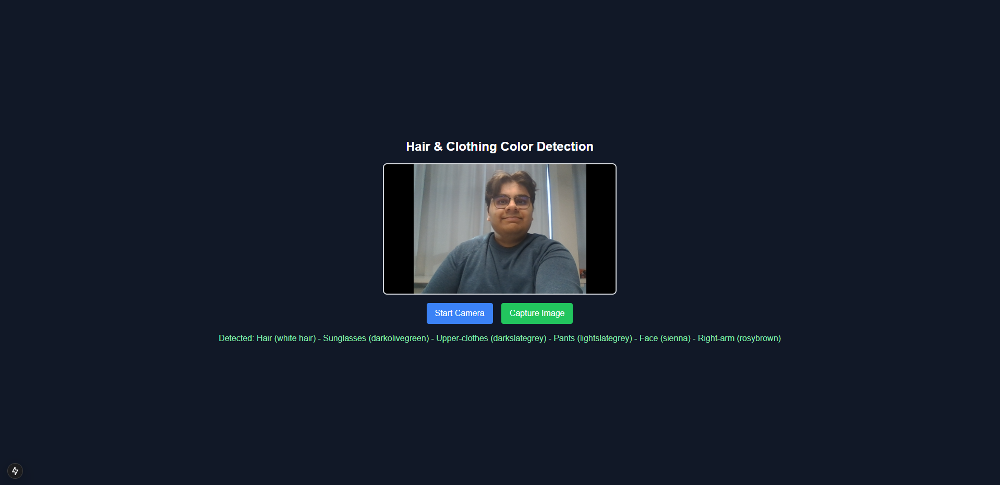

# C3L Fashion Mirror

## Installation Guide

### Prerequisites

Make sure you have Python installed on your system. You can download it from [here](https://www.python.org/downloads/).

Git clone this repository by running the following command, and then change your directory to the cloned repository:

```bash
git clone https://github.com/Harmxn02/C3L-FashionMirror.git
cd C3L-FashionMirror
```

### Running the Application

After that, you need to install the necessary Python dependencies. You can do this by running the following command:

```bash
pip install -r requirements.txt
```

#### Backend

You will need two terminal windows to run the backend and frontend of the application. In the first terminal window, change your directory to the `backend` folder and run the following command:

```bash
cd backend
uvicorn main:app --host 0.0.0.0 --port 8000 --reload
```

#### Frontend

In the second terminal window, change your directory to the `frontend` folder and run the following command:

```bash
cd frontend
npm install
npm run dev
```

After running the above commands, you can access the application by visiting `http://localhost:3000/` in your web browser.

### Usage

In the frontend application, you press the "Start Camera" button to start the camera.
You can then press the "Take Picture" button to take a picture of yourself.
The AI model will then detect the clothing items you are wearing (and their colors) and display it on the screen.

### Tools Used

- [FastAPI](https://fastapi.tiangolo.com/)
- [Next.js](https://nextjs.org/)
- [Tailwind CSS](https://tailwindcss.com/)
- [Hugging Face](https://huggingface.co/)

### Demo

This is what it should look like: 

The models I used are pre-trained ones from Hugging Face, so the detections are not completely on point, but if you were to train a model yourself, you could get better results.

The colours are detected by taking the average colour of the bounding boxes of the detected clothing items, so they might be wrong too.
